# Flowchart Sistem Akuntansi UMKM

## Gambaran Umum

Aplikasi ini merupakan sistem akuntansi UMKM dengan konsep **double-entry accounting**.

Semua transaksi bisnis seperti:

- Penjualan
- Pembelian
- Penerimaan kas/bank
- Pembayaran kas/bank
- Pergerakan stok
- Penyusutan aset
- Jurnal manual

akan diproses dan diposting ke:

- `journals`
- `journal_lines`

Kedua tabel tersebut menjadi pusat pencatatan akuntansi dan sumber utama untuk menghasilkan laporan.

---

## 1. Flowchart Utama Sistem

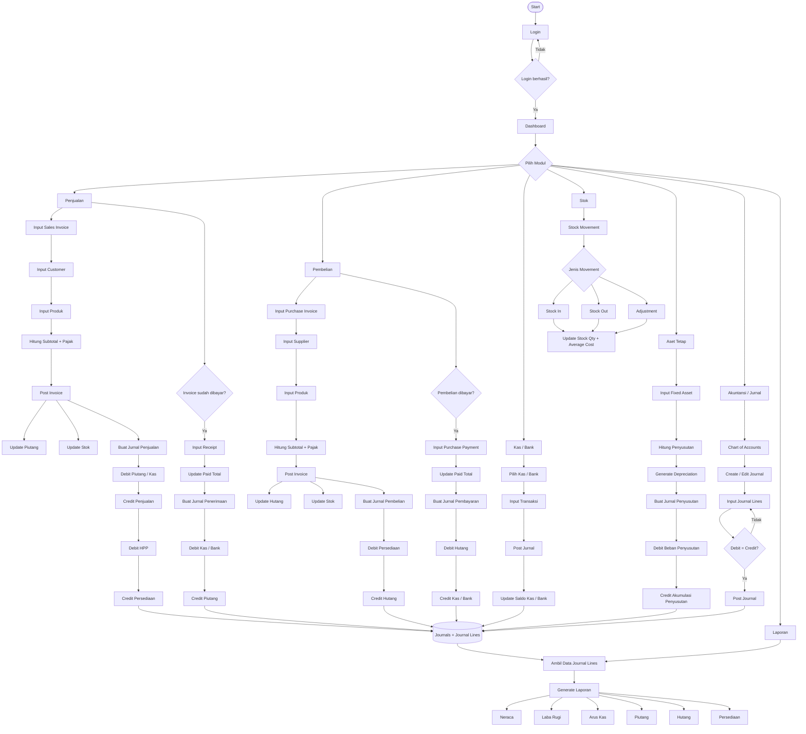

---

## 2. Flowchart Sederhana Arsitektur Sistem

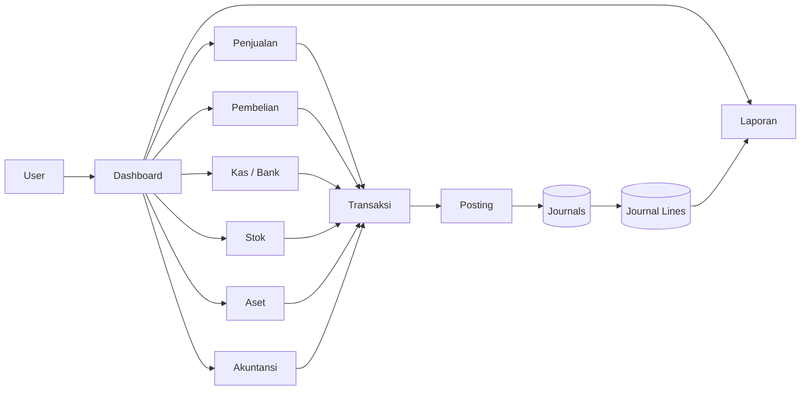

### Konsep utama

```text
Transaksi Bisnis
       │
       ▼
   Diproses
       │
       ▼
    Posting
       │
       ▼
  ┌───────────────┐
  │   Journals    │
  │       +       │
  │ Journal Lines │
  └───────┬───────┘
          │
          ▼
       Laporan
```

---

## 3. Flowchart Penjualan

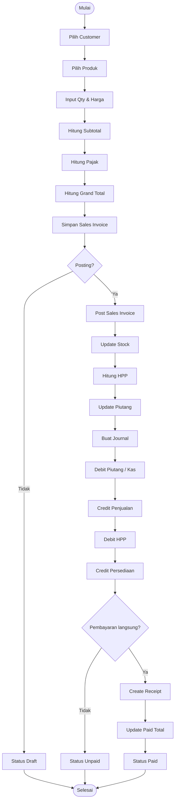

### Tabel yang terlibat

- `customers`
- `sales_invoices`
- `sales_invoice_lines`
- `products`
- `stock_movements`
- `receipts`
- `cash_bank_accounts`
- `journals`
- `journal_lines`
- `chart_of_accounts`
- `taxes`

---

## 4. Flowchart Pembelian

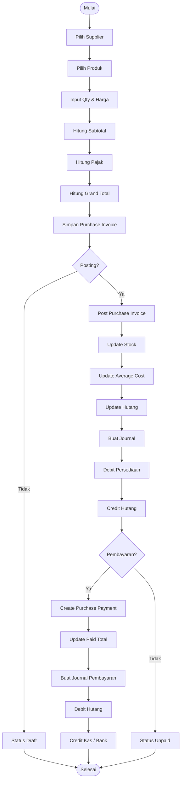

### Tabel yang terlibat

- `suppliers`
- `purchase_invoices`
- `purchase_invoice_lines`
- `products`
- `stock_movements`
- `purchase_payments`
- `cash_bank_accounts`
- `journals`
- `journal_lines`
- `chart_of_accounts`
- `taxes`

---

## 5. Flowchart Stok

Sistem menggunakan metode **Average Cost** untuk menghitung HPP.

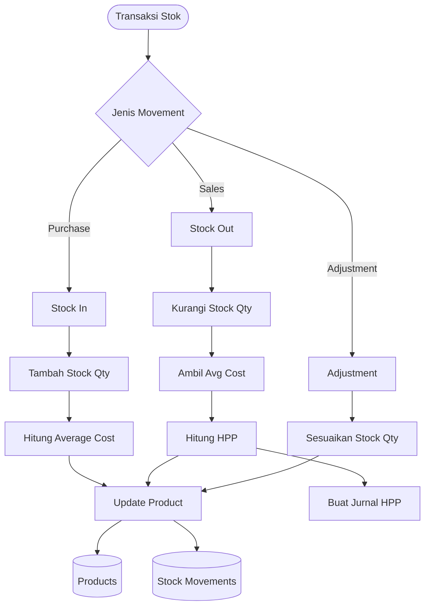

### Tabel yang terlibat

- `products`
- `stock_movements`
- `sales_invoice_lines`
- `purchase_invoice_lines`
- `journals`
- `journal_lines`

---

## 6. Flowchart Aset Tetap

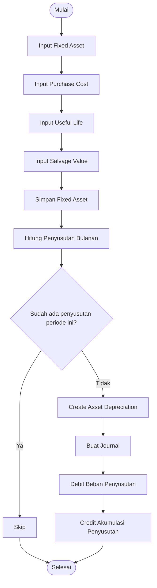

### Rumus penyusutan

```text
Penyusutan per bulan =
(Purchase Cost - Salvage Value)
÷ Useful Life dalam bulan
```

### Tabel yang terlibat

- `fixed_assets`
- `asset_depreciations`
- `journals`
- `journal_lines`
- `chart_of_accounts`

---

## 7. Flowchart Akuntansi / Double-Entry

Ini merupakan inti dari sistem.

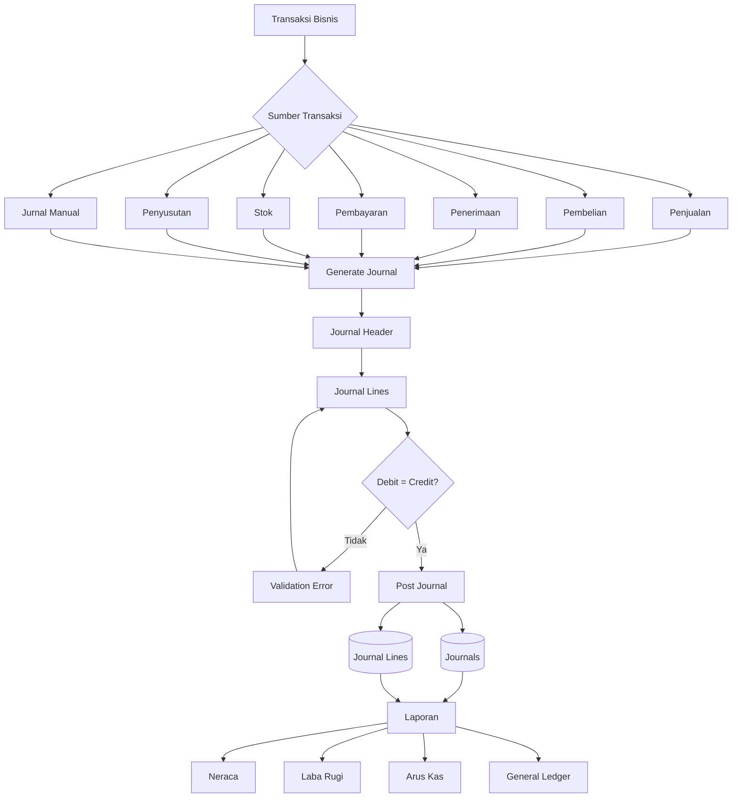

---

## 8. Flowchart Penerimaan Piutang

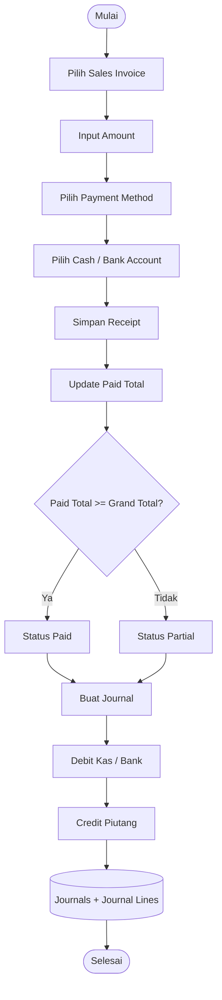

---

## 9. Flowchart Pembayaran Hutang

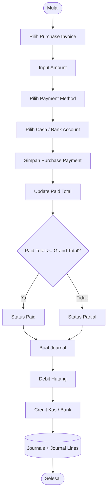

---

## 10. Flowchart Jurnal Manual

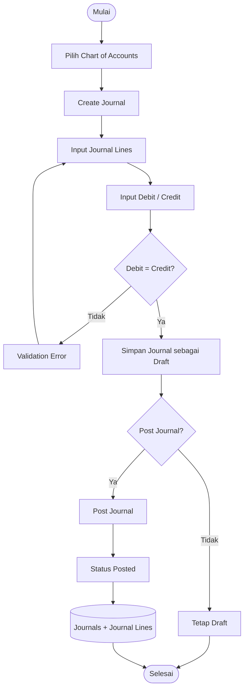

---

## 11. Flowchart Laporan

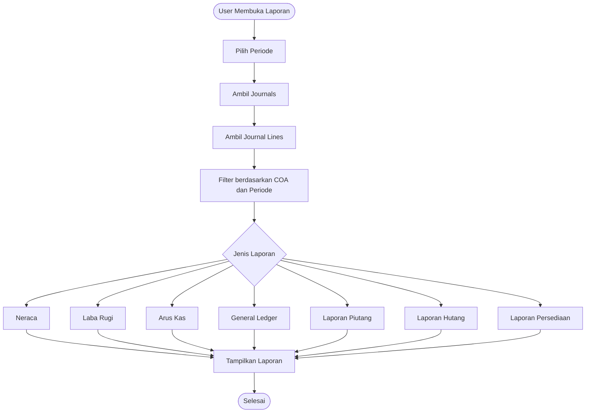

---

# Arsitektur Utama Sistem

```text
                         ┌───────────────┐
                         │     USER      │
                         └───────┬───────┘
                                 │
                         ┌───────▼───────┐
                         │   DASHBOARD   │
                         └───────┬───────┘
                                 │
          ┌──────────────────────┼──────────────────────┐
          │          │           │          │            │
          ▼          ▼           ▼          ▼            ▼
     Penjualan   Pembelian   Kas/Bank     Stok       Aset Tetap
          │          │           │          │            │
          └──────────┴───────────┴──────────┴────────────┘
                                 │
                                 ▼
                         ┌───────────────┐
                         │    POSTING    │
                         └───────┬───────┘
                                 │
                  ┌──────────────▼──────────────┐
                  │          JOURNALS            │
                  │              +               │
                  │        JOURNAL_LINES         │
                  └──────────────┬──────────────┘
                                 │
                         ┌───────▼───────┐
                         │    LAPORAN    │
                         └───────┬───────┘
                                 │
             ┌───────────────────┼───────────────────┐
             │                   │                   │
             ▼                   ▼                   ▼
          Neraca             Laba Rugi           Arus Kas
```

---

# Modul dan Tabel Utama

| Modul | Tabel Utama |
|---|---|
| User | `users` |
| Profil Bisnis | `business_profiles` |
| Akun | `chart_of_accounts` |
| Pajak | `taxes` |
| Jurnal | `journals`, `journal_lines` |
| Kas / Bank | `cash_bank_accounts` |
| Produk | `products` |
| Stok | `stock_movements` |
| Customer | `customers` |
| Penjualan | `sales_invoices`, `sales_invoice_lines` |
| Penerimaan | `receipts` |
| Supplier | `suppliers` |
| Pembelian | `purchase_invoices`, `purchase_invoice_lines` |
| Pembayaran | `purchase_payments` |
| Aset | `fixed_assets` |
| Penyusutan | `asset_depreciations` |

---

# Alur Data Utama

## Penjualan

```text
Customer
   ↓
Sales Invoice
   ↓
Sales Invoice Lines
   ↓
Post
   ├──→ Stock Movement (OUT)
   ├──→ Hitung HPP
   ├──→ Update Piutang
   └──→ Journal
            ├── Debit Piutang / Kas
            ├── Credit Penjualan
            ├── Debit HPP
            └── Credit Persediaan
```

## Pembelian

```text
Supplier
   ↓
Purchase Invoice
   ↓
Purchase Invoice Lines
   ↓
Post
   ├──→ Stock Movement (IN)
   ├──→ Update Average Cost
   ├──→ Update Hutang
   └──→ Journal
            ├── Debit Persediaan
            └── Credit Hutang
```

## Pembayaran / Penerimaan

```text
Receipt / Purchase Payment
          ↓
    Update Paid Total
          ↓
       Journal
          ↓
   Kas / Bank berubah
```

## Penyusutan

```text
Fixed Asset
     ↓
Hitung Depresiasi
     ↓
Asset Depreciation
     ↓
Journal
     ├── Debit Beban Penyusutan
     └── Credit Akumulasi Penyusutan
```

---

# Prinsip Utama Sistem

1. **Semua transaksi keuangan harus menghasilkan jurnal.**
2. Setiap jurnal harus memiliki minimal satu debit dan satu credit.
3. Total debit harus sama dengan total credit sebelum jurnal dapat diposting.
4. `journals` menyimpan informasi header jurnal.
5. `journal_lines` menyimpan detail akun debit dan credit.
6. Modul penjualan, pembelian, kas/bank, stok, dan aset terintegrasi dengan jurnal.
7. Laporan akuntansi mengambil data dari jurnal yang sudah berstatus `posted`.
8. Stok menggunakan metode **average cost**.
9. Invoice dapat memiliki status `draft`, `unpaid`, `partial`, `paid`, atau `void`.
10. Jurnal dapat memiliki status `draft`, `posted`, atau `void`.

---

# Ringkasan Arsitektur

```text
                    BUSINESS TRANSACTION
                            │
          ┌─────────────────┼─────────────────┐
          │                 │                 │
       Penjualan         Pembelian        Kas/Bank
          │                 │                 │
          ├─────────────────┼─────────────────┤
          │                 │                 │
          ▼                 ▼                 ▼
        Stok             Hutang             Kas
          │                 │                 │
          └─────────────────┼─────────────────┘
                            │
                            ▼
                       ACCOUNTING
                            │
                            ▼
                    ┌───────────────┐
                    │    JOURNAL    │
                    │      +        │
                    │ JOURNAL LINES │
                    └───────┬───────┘
                            │
                            ▼
                         REPORTS
                            │
             ┌──────────────┼──────────────┐
             ▼              ▼              ▼
           Neraca       Laba Rugi       Arus Kas
```

**Kesimpulan:** `journals` dan `journal_lines` merupakan **central accounting engine** dari sistem. Modul lain menghasilkan transaksi, sedangkan jurnal menjadi sumber pencatatan double-entry dan laporan akuntansi.
