# Flowchart Sistem Akuntansi UMKM

Dokumen flowchart berdasarkan DBML `akuntansi_umkm`.

## 1. Flowchart Utama

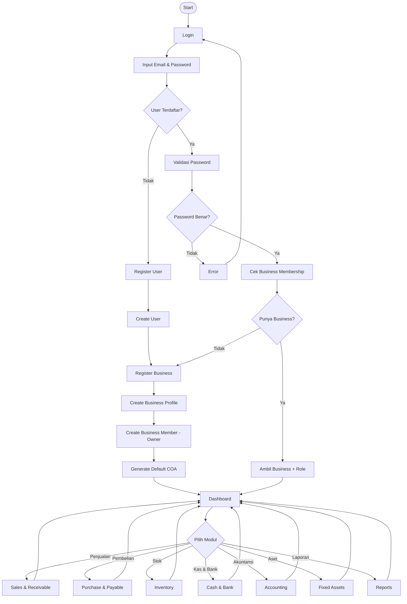

## 2. Authentication & Business Onboarding

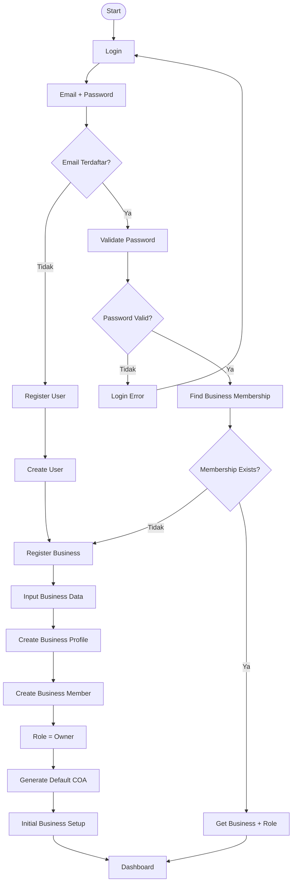

## 3. Penjualan

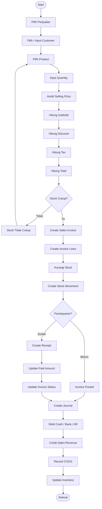

## 4. Pembelian

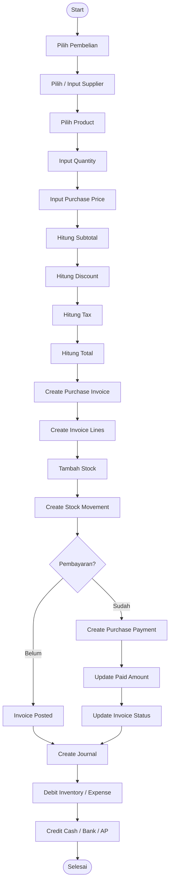

## 5. Inventory / Stock

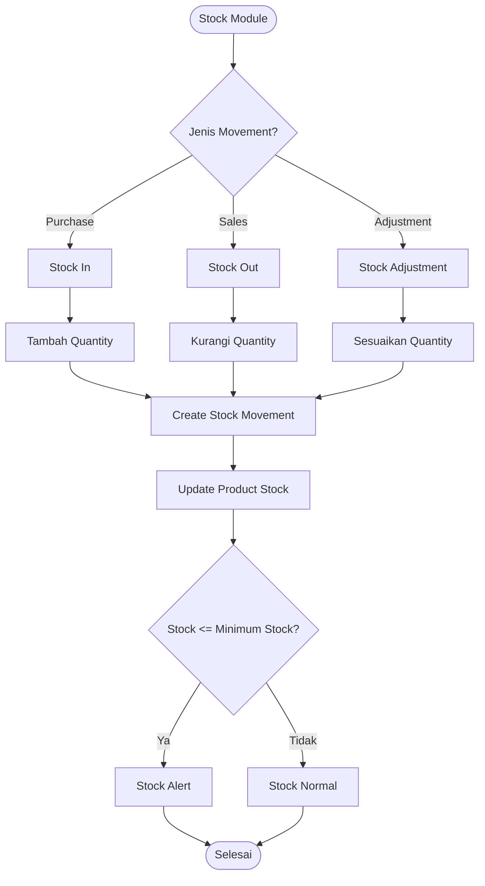

## 6. Kas & Bank

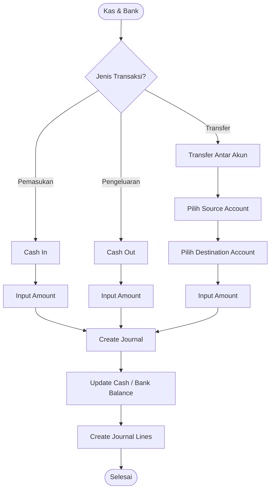

## 7. Accounting / Jurnal

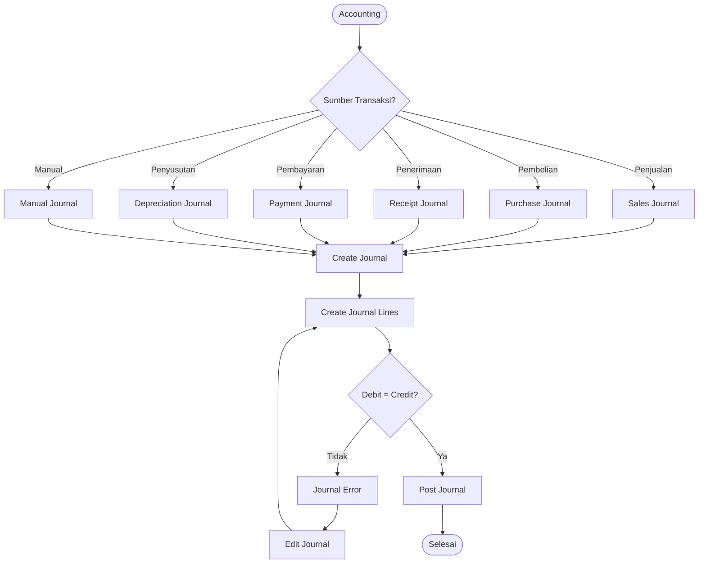

## 8. Piutang / Receivable

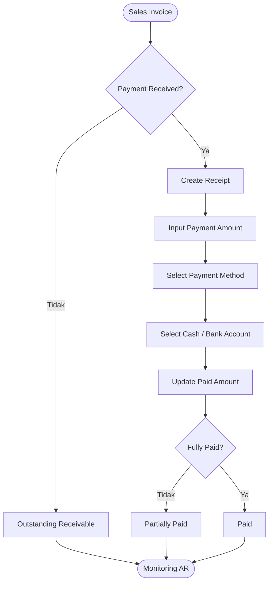

## 9. Hutang / Payable

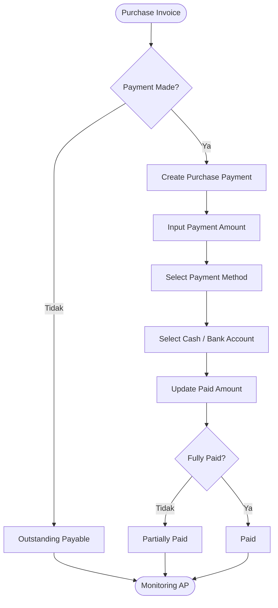

## 10. Fixed Asset & Depreciation

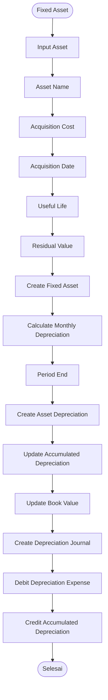

Rumus penyusutan garis lurus:

```text
Depreciation = (Acquisition Cost - Residual Value) / Useful Life
```

## 11. Chart of Accounts

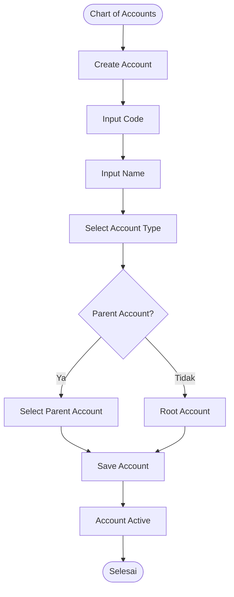

## 12. Tax

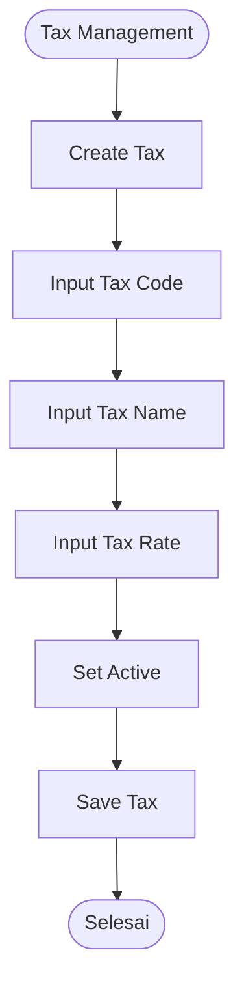

## 13. Dashboard

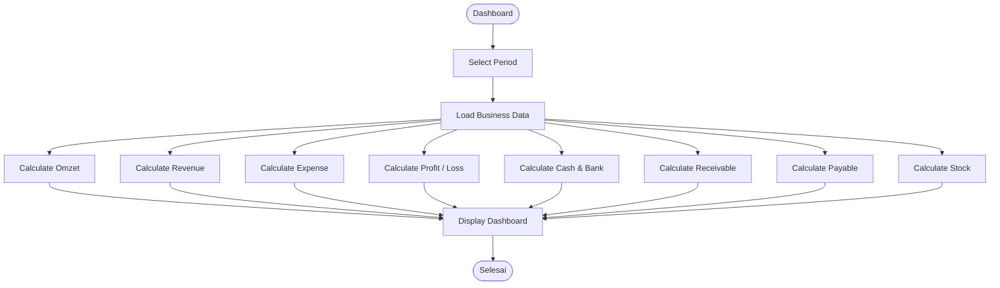

## 14. Reports

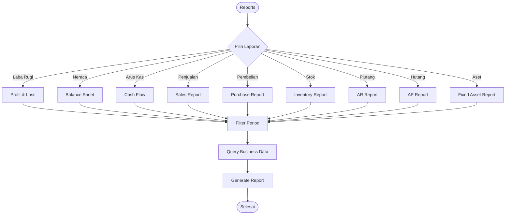

## 15. Relasi Besar Antar Modul

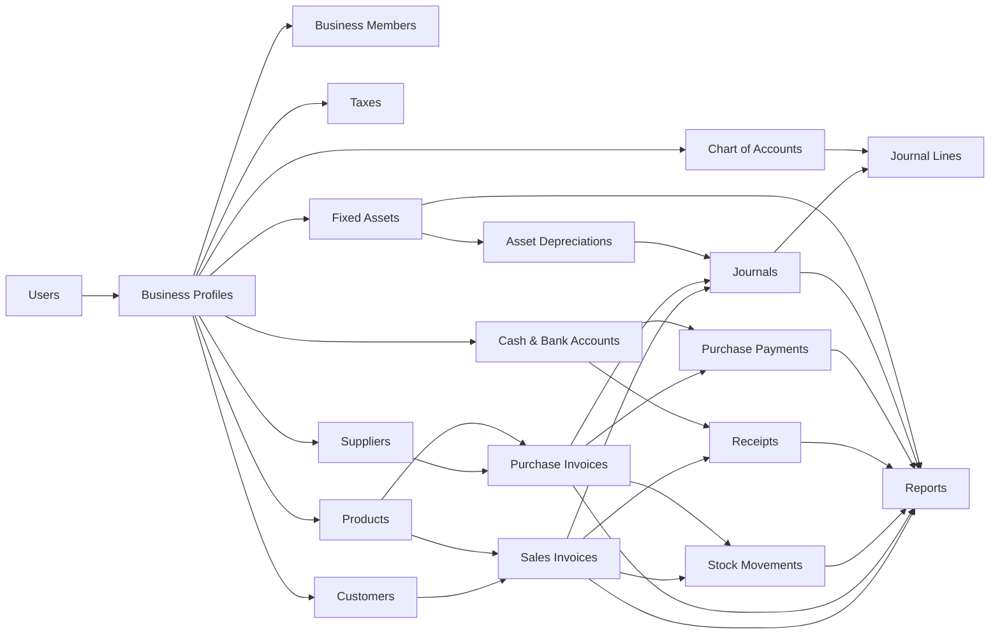

## 16. Multi-Tenant / Business Isolation

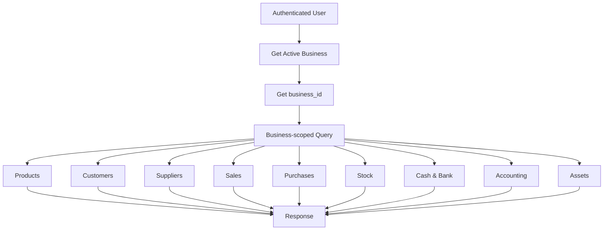

Aturan utama:

```text
User
  ↓
Business Membership
  ↓
business_id
  ↓
Business-scoped Query
  ↓
Business Data
```

## 17. Gambaran Arsitektur Keseluruhan

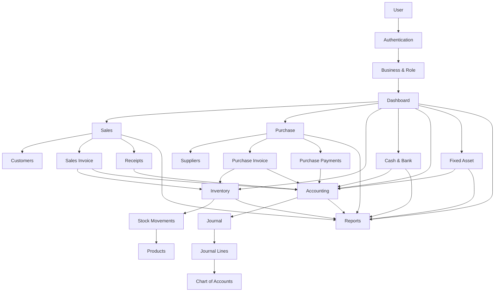

## 18. Core Business Flow

```text
REGISTER / LOGIN
       ↓
BUSINESS
       ↓
DASHBOARD
       ↓
┌──────────────┬──────────────┬──────────────┐
│   PENJUALAN  │   PEMBELIAN  │     STOK     │
└──────┬───────┴──────┬───────┴──────┬───────┘
       ↓              ↓              ↓
   RECEIPT         PAYMENT       MOVEMENT
       │              │              │
       └──────────────┼──────────────┘
                      ↓
                  ACCOUNTING
                      ↓
              JOURNAL & LINES
                      ↓
                   REPORTS
                      ↓
        ┌─────────────┼─────────────┐
        ↓             ↓             ↓
     LABA RUGI      NERACA       ARUS KAS
```

## 19. Ringkasan Modul

| Modul | Tabel |
|---|---|
| Authentication | `users` |
| Business | `business_profiles`, `business_members` |
| COA | `chart_of_accounts` |
| Tax | `taxes` |
| Accounting | `journals`, `journal_lines` |
| Cash & Bank | `cash_bank_accounts` |
| Product | `products` |
| Inventory | `stock_movements` |
| Customer | `customers` |
| Sales | `sales_invoices`, `sales_invoice_lines` |
| Receivable | `receipts` |
| Supplier | `suppliers` |
| Purchase | `purchase_invoices`, `purchase_invoice_lines` |
| Payable | `purchase_payments` |
| Fixed Asset | `fixed_assets`, `asset_depreciations` |
| Reports | Data dari seluruh modul |
